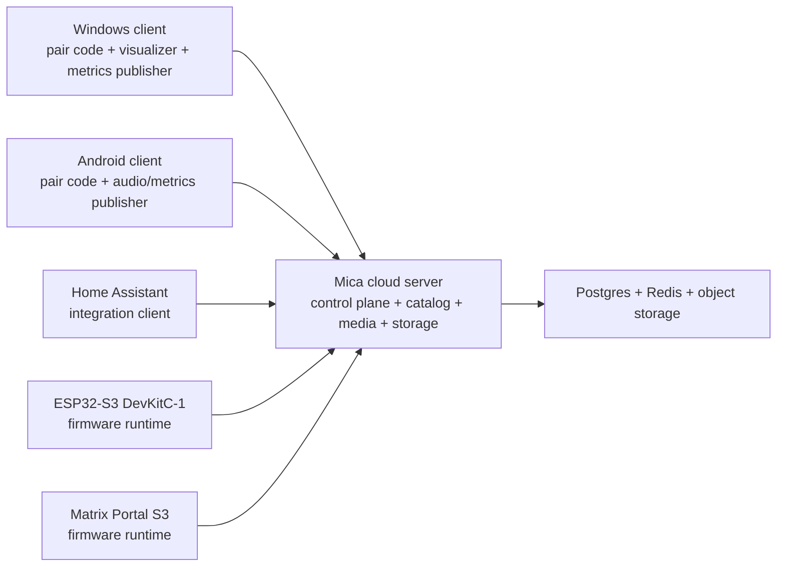
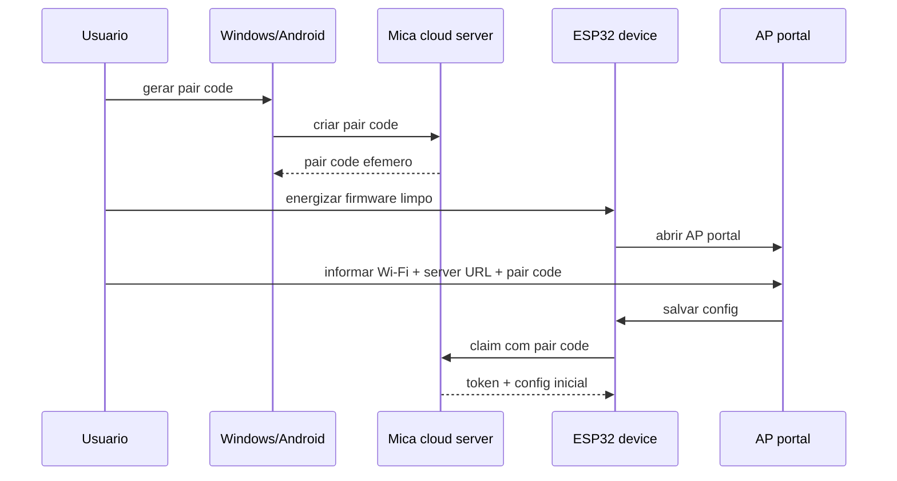

# 07 - Cloud-first Multi-panel Future Architecture

> **Status:** future-state / ainda nao implementado por completo.
>
> Este documento define a arquitetura alvo do Mica para operacao cloud-first, suporte multi-board, suporte multi-panel e onboarding desacoplado do desktop.
> A direcao aqui combina referencias de `Tronbyt`, `Pixoo` e `Tidbyt/Pixlet`, mas preserva decisoes proprias do Mica para `ESP32`, `HUB75`, `multi-board`, `cloud-first` e `realtime client-owned`.
>
> **Classificacao editorial na wiki:** este tambem e um documento de `futuras implementacoes`, mas permanece em `architecture/` por ser a especificacao canonica do target-state arquitetural do projeto.

## Objetivo

Descrever o estado futuro recomendado do Mica para:

1. operar com `servidor + firmware + clientes` desacoplados;
2. suportar `ESP32-S3 DevKitC-1` e `Matrix Portal S3`;
3. suportar `128x64`, `64x64` e `64x32`;
4. mover widgets cloud-safe para a nuvem;
5. manter audio e metricas locais como dados produzidos no cliente.

## Principios fechados

1. O Mica adota separacao clara entre `servidor`, `firmware` e `clientes`.
2. O servidor vira o control plane, catalogo, media pipeline, integrador e dono do estado duravel.
3. O firmware vira um runtime de display e sessao remota, nao um ponto de integracao de alto nivel.
4. Windows e Android deixam de ser "o host obrigatorio" do sistema e passam a ser clientes remotos.
5. O fluxo realtime continua nascendo no cliente local:
   - audio visualization;
   - metricas de desempenho do Windows;
   - metricas de desempenho do Android.
6. Widgets e paineis que nao dependem de estado local do cliente podem rodar do cloud.
7. O desktop deixa de ser o flasher oficial do target-state.
8. Home Assistant entra como integracao do servidor.
9. ESPHome permanece complementar e opcional, nao substitui o firmware principal do painel HUB75.
10. O Mica se inspira em tres familias de referencia com papeis diferentes:
    - `Tronbyt` para desacoplamento `server + firmware + clients`;
    - `Pixoo` para modelo hibrido `cloud + runtime local`;
    - `Tidbyt/Pixlet` para runtime de widgets/paineis, catalogo, instalacoes, preview e API de distribuicao.
11. O Mica nao copia o stack Tidbyt integralmente; ele reaproveita apenas os padroes de produto e operacao que ajudam no ecossistema Mica.
12. No vocabulrio futuro do Mica, a unidade principal nao e um `app` isolado, e sim um `painel` composto por `widgets`.
13. Cada widget funciona como um mini-app configuravel:
    - possui identidade propria;
    - possui configuracao propria;
    - participa da composicao visual do painel;
    - pode ficar sobreposto a outros widgets no mesmo painel.

## Topologia alvo



## Modos de runtime

### Cloud-rendered ou cloud-orchestrated

Este grupo cobre conteudo que pode ser produzido sem depender do estado local do Windows ou Android:

- GIFs
- imagens
- relogio
- clima
- widgets e paineis genericos
- dashboards alimentados por APIs da internet
- notificacoes e automacoes

O servidor pode:

1. resolver dados externos;
2. preprocessar midia;
3. gerar lotes para o tamanho do painel alvo;
4. entregar conteudo pronto ao firmware.

Referencia util do ecossistema Tidbyt:

1. `Pixlet` valida a separacao entre:
   - render local para preview e desenvolvimento;
   - render/export para distribuicao;
   - entrega posterior ao device.
2. O Mica pode adotar essa mesma separacao para widgets cloud-safe sem assumir `Pixlet` como engine obrigatoria.

### Client-derived realtime

Este grupo cobre conteudo que existe na maquina local e precisa nascer nela:

- visualizador de audio;
- nivel, beat, bins e afins;
- metricas de CPU, RAM, GPU, VRAM, temperatura, bateria e rede;
- dados locais do Android ou do Windows.

Regra fechada:

1. audio bruto nao sobe para a nuvem;
2. o cliente captura e processa localmente;
3. o cliente publica apenas payload compacto e pronto para roteamento.
4. Aqui o Mica diverge explicitamente do modelo mais cloud-rendered do Tidbyt: o visualizador de audio e as metricas locais continuam pertencendo ao cliente.

Exemplos de payload futuro:

- `bins`
- `level`
- `peak/beat`
- resumo de metricas
- frame compacto quando estritamente necessario

## Onboarding e pareamento oficiais

O onboarding alvo fica dividido em dois problemas diferentes:

1. `flash e bring-up de rede`, resolvidos fora do desktop oficial;
2. `claim da conta e vinculacao ao servidor`, resolvidos pelo pair code e pelo portal AP.

Fluxo oficial futuro:

1. o firmware e baixado do repositorio ou do catalogo oficial;
2. o flash e feito por ferramenta externa;
3. Windows ou Android geram apenas um `pair code`;
4. o device limpo sobe em `AP portal`;
5. o usuario abre o portal AP do device;
6. o portal coleta:
   - `Wi-Fi`
   - `URL do servidor`
   - `pair code`
7. o firmware usa esses dados para executar o `claim` na nuvem;
8. o device passa a operar como cliente autenticado do servidor.

Regra fechada:

1. o desktop nao e mais o flasher oficial no estado alvo;
2. o app desktop e o app Android ficam responsaveis por gerar `pair code` e operar o ecossistema;
3. o portal AP vira o baseline de claim/configuracao do firmware limpo.
4. A referencia util do Tidbyt aqui nao e o onboarding movel deles, e sim o lifecycle de `instalacao` e vinculacao de paineis/composicoes ao device depois que o device ja entrou no ecossistema.



## Protocolo publico futuro

O protocolo publico do target-state fica assim:

1. `HTTPS`
   - pairing
   - claim
   - catalogo
   - firmware
   - downloads de midia
   - comandos administrativos
2. `WSS`
   - sessao canonicamente publica para devices
   - sessao de publisher para Windows/Android
   - telemetria
   - presenca
   - progresso
   - stream compacto de visualizacao

Regra fechada:

1. `MQTT` sai do caminho publico cloud-first;
2. `MQTT` pode continuar apenas como legado/local durante transicao;
3. o servidor atual `HTTP + WS + MQTT embutido no WinUI` passa a ser baseline temporario, nao o estado final.
4. A API publica do Tidbyt e uma boa referencia conceitual para distinguir:
   - `device push`
   - `install`
   - `installations`
   - `preview`
   - `logs/versions`
   mas o Mica nao assume compatibilidade wire nem paridade literal de endpoints.
5. No Mica, esses conceitos futuros se aplicam principalmente a:
   - `push` de conteudo pontual;
   - `install` de um painel;
   - `preview` de uma composicao de widgets;
   - gestao de configuracoes e versoes da composicao ativa.

## Taxonomia futura de hardware e display

O vocabulrio alvo do ecossistema passa a separar board, backend e geometria:

- `boardModel`
- `displayBackend`
- `panelProfileId`
- `panelWidth`
- `panelHeight`
- `firmwareProfile`

### boardModel

Boards oficialmente considerados neste documento:

- `esp32s3_devkitc1`
- `matrixportal_s3`

### displayBackend

Backends alvo:

- `dma_hub75` para `ESP32-S3 DevKitC-1`
- `protomatter_hub75` ou equivalente para `Matrix Portal S3`

### panelProfileId

Perfis de painel alvo:

- `hub75_128x64`
- `hub75_64x64`
- `hub75_64x32`

### Dimensoes explicitas

`panelWidth` e `panelHeight` passam a ser dimensoes explicitas do perfil. O sistema nao deve depender apenas do slug do painel para inferir geometria.

## Matriz de suporte oficial futura

| Board | Backend | 128x64 | 64x64 | 64x32 | Observacao |
| --- | --- | --- | --- | --- | --- |
| ESP32-S3 DevKitC-1 | `dma_hub75` | Sim | Sim | Sim | Linha principal de maior folga de memoria |
| Matrix Portal S3 | `protomatter_hub75` | Nao | Sim | Sim | Limite oficial deste documento: no maximo `64x64` |

### Aviso especifico do Matrix Portal S3

O `Matrix Portal S3` entra neste target-state com limite oficial de no maximo `64x64`.

Motivo arquitetural:

1. o board oficial documenta `8 MB flash + 2 MB PSRAM`;
2. no ESP32-S3, RAM externa ajuda, mas ainda existem restricoes importantes:
   - buffers DMA continuam pressionando memoria interna;
   - task stacks continuam em memoria interna por default;
   - descritores DMA nao podem ficar em PSRAM.

Por isso, este documento fecha que:

1. nao existe artefato oficial `matrixportal_s3 + 128x64`;
2. a UI futura deve filtrar esse par como combinacao invalida;
3. o catalogo futuro nao deve anunciar essa geometria para esse board.

## Catalogo e distribuicao de firmware

O catalogo oficial deixa de ser `um firmware unico` e passa a ser uma matriz `board + panel + profile`.

Nome de artefato futuro:

```text
<boardModel>-<panelWidth>x<panelHeight>-<profile>_merged.bin
```

Exemplos de familia:

- `esp32s3-devkitc1-128x64-dma_exp_merged.bin`
- `esp32s3-devkitc1-64x64-dma_exp_merged.bin`
- `esp32s3-devkitc1-64x32-dma_exp_merged.bin`
- `matrixportal-s3-64x64-protomatter_exp_merged.bin`
- `matrixportal-s3-64x32-protomatter_exp_merged.bin`

O manifesto futuro deve documentar ao menos:

- `boardModel`
- `displayBackend`
- `panelProfileId`
- `panelWidth`
- `panelHeight`
- `profile`
- `controlPlane`
- `firmwareVersion`

Regras fechadas:

1. o catalogo oficial filtra combinacoes invalidas por board;
2. `Matrix Portal S3` nao recebe artefato oficial `128x64`;
3. a UI futura deve apresentar apenas variantes oficialmente suportadas.

### Widgets, paineis e configuracao

No Mica, a unidade principal de experiencia e o `painel`. Um painel agrupa widgets renderizados no mesmo canvas e os widgets podem ficar sobrepostos.

Cada widget funciona como um mini-app configuravel dentro do painel:

1. possui sua propria configuracao;
2. pode ter estado e preview proprios;
3. participa da composicao visual do painel;
4. pode coexistir e se sobrepor a outros widgets.

O ecossistema futuro do Mica deve usar como referencia de produto o Tidbyt para tres distincoes importantes:

1. `push` efemero, para mostrar um conteudo ou composicao uma vez;
2. `install` persistente, para colocar um painel na rotacao normal do device;
3. `preview`, para validar visual e configuracao antes de efetivar a instalacao do painel.

Tambem entra como referencia futura a ideia de configuracao tipada por widget, inspirada no `schema` do Tidbyt:

- `Text`
- `Toggle`
- `Color`
- `Typeahead`
- campos dinamicos equivalentes

Regra fechada:

1. isso inspira o modelo do Mica para widgets e paineis;
2. isso nao obriga o projeto a adotar `Starlark`;
3. isso nao obriga o projeto a usar `Pixlet` como engine oficial.

## Pipeline de midia e resize no servidor

GIFs e imagens passam a ser pre-formatados pelo servidor para o painel alvo.

Pipeline futuro:

1. decode da midia original;
2. `coalesce` de animacao quando aplicavel;
3. resize para a geometria do painel;
4. reducao e dither pelo preset do perfil;
5. cache do resultado;
6. armazenamento do blob;
7. entrega ao device.

Regra fechada:

1. a politica futura usa `presets por painel`;
2. nao existe um algoritmo unico global para todos os tamanhos;
3. o default e `exact-fit` para a geometria alvo;
4. preservar aspecto, crop inteligente e outros modos ficam fora deste documento.

### Preset oficial para 128x64

```text
-coalesce
-filter Point
-resize 128x64!
-posterize 8
-dither FloydSteinberg
-colors 32
-layers Optimize
```

### Preset oficial para 64x64 e 64x32

```text
-coalesce
-filter Mitchell
-resize <target>!
-unsharp 0x1
-ordered-dither o8x8,32
-posterize 32
-layers Optimize
```

Implicacoes arquiteturais:

1. o servidor precisa conhecer a geometria real do device;
2. o blob resultante deve ser cacheavel por `board/panel/profile/source`;
3. lotes `WebP` e midias derivadas nao podem existir apenas em memoria do processo no target-state cloud.
4. O fato de o ecossistema Tidbyt/Pixlet tratar render como saida `WebP` ou `GIF` reforca que o Mica esta na direcao correta ao prever um pipeline server-side de render/export para midias cloud-safe.

## Servidor em nuvem e Render

O servidor alvo e:

1. standalone;
2. Dockerizavel;
3. apto a deploy em plataforma publica como [Render](https://render.com/).

Primeira fase cloud:

1. `single-instance`;
2. `HTTPS/WSS` como superficie publica;
3. sem dependencia de `MQTT publico`;
4. sem depender de filesystem local como storage primario.

Responsabilidades de storage:

- `Postgres` para estado duravel
- `Redis` ou `Key Value` para estado efemero
- `object storage` para firmware, midias redimensionadas e lotes `WebP`

Regra fechada:

1. blobs de firmware e midia nao podem depender de memoria do processo;
2. batches de paineis nao podem continuar so em dicionarios em memoria no estado cloud-first;
3. a arquitetura publica precisa convergir para `HTTPS/WSS`.

## Windows e Android

### Windows

Windows vira:

1. cliente remoto do servidor;
2. gerador de `pair code`;
3. publisher de visualizacao de audio e metricas locais;
4. superficie de operacao e administracao do ecossistema.

### Android

Android vira:

1. cliente remoto do servidor;
2. gerador de `pair code`;
3. publisher futuro de audio local e metricas locais;
4. app de controle e operacao do device.

Limitacao fechada:

1. Android nao equivale ao WASAPI loopback do Windows;
2. playback capture depende da plataforma e do app-fonte permitir captura;
3. o produto deve tratar isso como limitacao explicita, nao como garantia universal.
4. O Mica diverge do Tidbyt ao manter audio visualizer e metricas locais como conteudo `client-owned`, nao como algo prioritariamente cloud-rendered.

## Referencias uteis do ecossistema Tidbyt

O ecossistema Tidbyt e util para o Mica principalmente como referencia de produto, runtime e API, nao como blueprint de firmware.

### Pixlet

`Pixlet` se descreve como `app runtime and UX toolkit for highly-constrained displays`.

Isso e util para o Mica como referencia de:

1. runtime de widgets e paineis para displays pequenos;
2. fluxo `build -> render -> serve -> push`;
3. separacao entre authoring de composicoes, preview local e distribuicao para device.

### Build, render, serve e push

O Tidbyt ajuda a deixar mais clara a distincao entre:

1. preview local de desenvolvimento;
2. render offline/export;
3. envio ao device;
4. exibicao pontual versus instalacao persistente.

No Mica, isso ajuda a orientar a separacao entre:

1. editor/preview local;
2. render server-side para widgets cloud-safe;
3. `push` efemero para testes, notificacoes e comandos pontuais;
4. `install` persistente para paineis ativos compostos por widgets.

### API publica

A API publica do Tidbyt e uma referencia util para o shape conceitual de operacao remota de devices:

1. `push`
2. `install`
3. `installations`
4. `preview`
5. `logs`
6. `versions`

No Mica, isso sugere um modelo publico mais rico que apenas "enviar frame" ou "ativar painel", sem obrigar compatibilidade literal de endpoints.

### Schema

O `schema` do Tidbyt e uma referencia forte para configuracao tipada de widgets.

Isso e util no Mica para:

1. editor compartilhado de configuracao;
2. futuras UIs WinUI, Android e web;
3. persistencia de configuracao mais previsivel;
4. catalogo de widgets com configuracao validavel;
5. composicao de paineis onde cada widget carrega sua propria configuracao.

### Authoring Apps

O guia `Authoring Apps` do Tidbyt e especialmente util para o Mica em:

1. defaults obrigatorios;
2. politicas de cache por widget;
3. secrets;
4. tratamento de erro sem quebrar o widget inteiro;
5. profiling/performance.

### Widgets, animations, fonts e modules

Essas referencias sao uteis para o Mica como base de:

1. composicao declarativa em displays pequenos;
2. tipografia e legibilidade em baixa resolucao;
3. primitives de animacao;
4. pequenos modulos utilitarios para widgets orientados a dados.

## O que o Mica nao copia do Tidbyt

Para evitar leitura ambigua desta arquitetura:

1. o Mica nao fica preso a um runtime unico tipo `Pixlet`;
2. o Mica nao terceiriza o realtime de audio para o cloud;
3. o Mica nao adota o formato, SDK ou API do Tidbyt como contrato publico do projeto;
4. o Mica continua centrado em `ESP32 + HUB75 + multi-board`;
5. o Mica preserva a ideia de `realtime local` como responsabilidade do cliente.

## Home Assistant e ESPHome

### Home Assistant

Home Assistant entra como integracao do servidor para:

- automacoes
- troca de paineis
- notificacoes
- sensores
- dashboards residenciais
- acao remota sobre devices

Regra fechada:

1. Home Assistant conversa com o servidor;
2. Home Assistant nao e o control plane principal do firmware.

### ESPHome

ESPHome entra como ecossistema complementar para:

- sensores auxiliares;
- prototipacao rapida;
- displays e devices secundarios;
- fontes de dados para automacao.

Regra fechada:

1. ESPHome nao substitui o firmware principal do painel HUB75;
2. o runtime principal do display continua sendo firmware dedicado do Mica.

## Status atual vs alvo futuro

| Tema | Estado atual | Alvo futuro |
| --- | --- | --- |
| Servidor | embutido no WinUI | servico cloud standalone |
| Control plane publico | HTTP + WS + MQTT local | HTTPS + WSS |
| Firmware oficial | DevKitC-1 `128x64` unico | matriz multi-board e multi-panel |
| Boards oficiais | `esp32s3_devkitc1` | `esp32s3_devkitc1` + `matrixportal_s3` |
| Geometria oficial | `128x64` | `128x64`, `64x64`, `64x32` |
| Onboarding | wizard desktop com flash | flash externo + pair code + AP portal |
| Pairing | desktop host local | cliente Windows/Android + cloud claim |
| Batches de paineis | memoria do processo | object storage + cache |
| Visualizador de audio | pipeline local do Windows | publishers Windows/Android + roteamento cloud |

## Roadmap recomendado

### Fase 1 - Servidor standalone cloud-ready

Objetivo:

1. extrair o servidor do papel de host obrigatorio do WinUI;
2. tornar o deploy por Docker um caminho oficial;
3. preparar storage duravel e efemero.

Dependencia principal:

- separar runtime do servidor do runtime do app desktop.

Ganho esperado:

- base para cloud-first e Render.

### Fase 2 - Catalogo multi-board e multi-panel

Objetivo:

1. trocar o catalogo de firmware unico por uma matriz `board + panel + profile`;
2. introduzir taxonomia explicita de `boardModel`, `displayBackend` e `panelProfileId`;
3. filtrar combinacoes invalidas por capacidade oficial.

Dependencia principal:

- refatorar o catalogo e os manifestos de firmware.

Ganho esperado:

- baseline oficial para `128x64`, `64x64` e `64x32`.

### Fase 3 - Firmware direct-to-cloud

Objetivo:

1. fazer o firmware operar com sessao cloud direta;
2. priorizar `HTTPS/WSS`;
3. reduzir `MQTT` a legado/local.

Dependencia principal:

- sessao publica canonicamente suportada no servidor.

Ganho esperado:

- devices independentes do host desktop local.

### Fase 4 - Pipeline server-side de midia

Objetivo:

1. preprocessar GIFs e imagens no servidor;
2. aplicar presets por perfil de painel;
3. armazenar blobs resultantes de forma distribuivel.

Dependencia principal:

- storage de blobs e identificacao confiavel da geometria do device.

Ganho esperado:

- qualidade mais consistente entre `128x64`, `64x64` e `64x32`.

### Fase 5 - Windows remote-first

Objetivo:

1. fazer o desktop operar como cliente remoto;
2. manter visualizador e metricas locais como publishers;
3. deixar o cloud como dono de sessao e roteamento.

Dependencia principal:

- protocolo publisher-to-server.

Ganho esperado:

- desacoplamento real entre runtime local e infraestrutura.

### Fase 6 - Android client

Objetivo:

1. criar cliente Android com `pair code`, operacao remota e publishers locais;
2. tratar playback capture como capacidade condicional da plataforma.

Dependencia principal:

- experiencia minima remota consolidada no servidor.

Ganho esperado:

- expansao do ecossistema alem do Windows.

### Fase 7 - Home Assistant

Objetivo:

1. expor automacao e integracao do lado do servidor;
2. permitir acionar paineis, notificacoes e dados externos.

Dependencia principal:

- API de servidor estavel para automacao.

Ganho esperado:

- valor pratico para casa inteligente e automacao.

## Referencias de codigo

- [LedDefaults](../../../src/MicaAudio.Core/Led/LedDefaults.cs#L1) - assinatura esperada: `public static class LedDefaults`
- [PrecompiledFirmwareService](../../../src/App.WinUI/Services/Firmware/PrecompiledFirmwareService.cs#L1) - assinatura esperada: `internal sealed partial class PrecompiledFirmwareService`
- [DeviceServerHost](../../../src/Device.Server/Hosting/DeviceServerHost.cs#L1) - assinatura esperada: `public sealed partial class DeviceServerHost`
- [DeviceServerHost.PanelsBatches](../../../src/Device.Server/Hosting/DeviceServerHost.PanelsBatches.cs#L1) - assinatura esperada: `public sealed partial class DeviceServerHost`
- [PanelsFrameComposer](../../../src/App.WinUI/Services/Panels/PanelsFrameComposer.cs#L1) - assinatura esperada: `internal sealed class PanelsFrameComposer`
- [Firmware main.cpp](../../../firmware/esp32s3-devkitc1/src/main.cpp#L1) - assinatura esperada: `void setup()`
- [mica_types.h](../../../firmware/esp32s3-devkitc1/src/mica_types.h#L1) - assinatura esperada: `#pragma once`

## Referencias

### Baseline atual da wiki

- [01 - System overview](01-system-overview.md)
- [Modulo Device.Server + Device.Protocol](../modules/device-server-protocol.md)
- [Modulo Paineis](../modules/paineis.md)
- [Modulo Server Build And Artifacts](../modules/server-build-and-artifacts.md)
- [Guia - Setup New Device](../guides/setup-new-device.md)

### Fontes primarias externas

- [ESP-IDF v5.5.4 - Support for External RAM / ESP32-S3](https://docs.espressif.com/projects/esp-idf/en/v5.5.4/esp32s3/api-guides/external-ram.html)
- [Adafruit Matrix Portal S3 - official guide](https://learn.adafruit.com/adafruit-matrixportal-s3/overview)
- [Android playback capture](https://developer.android.com/guide/topics/media/playback-capture)
- [AudioPlaybackCaptureConfiguration](https://developer.android.com/reference/android/media/AudioPlaybackCaptureConfiguration)
- [Render - Web Services](https://render.com/docs/web-services)
- [Render - WebSockets](https://render.com/docs/websocket)
- [Render - Docker](https://render.com/docs/docker)
- [Tidbyt Dev](https://tidbyt.dev/)
- [Tidbyt - Getting Started](https://tidbyt.dev/docs/overview/getting-started)
- [Tidbyt - Build for Tidbyt](https://tidbyt.dev/docs/build/build-for-tidbyt)
- [Tidbyt API](https://tidbyt.dev/docs/api)
- [Pixlet README](https://github.com/tidbyt/pixlet)
- [Pixlet - Schema](https://raw.githubusercontent.com/tidbyt/pixlet/main/docs/schema/schema.md)
- [Pixlet - Authoring Apps](https://raw.githubusercontent.com/tidbyt/pixlet/main/docs/authoring_apps.md)
- [Pixlet - Widgets](https://raw.githubusercontent.com/tidbyt/pixlet/main/docs/widgets.md)
- [Pixlet - Animations](https://raw.githubusercontent.com/tidbyt/pixlet/main/docs/animation.md)
- [Pixlet - Fonts](https://raw.githubusercontent.com/tidbyt/pixlet/main/docs/fonts.md)
- [Pixlet - Modules](https://raw.githubusercontent.com/tidbyt/pixlet/main/docs/modules.md)
